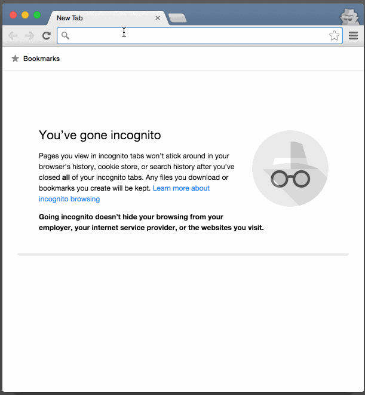
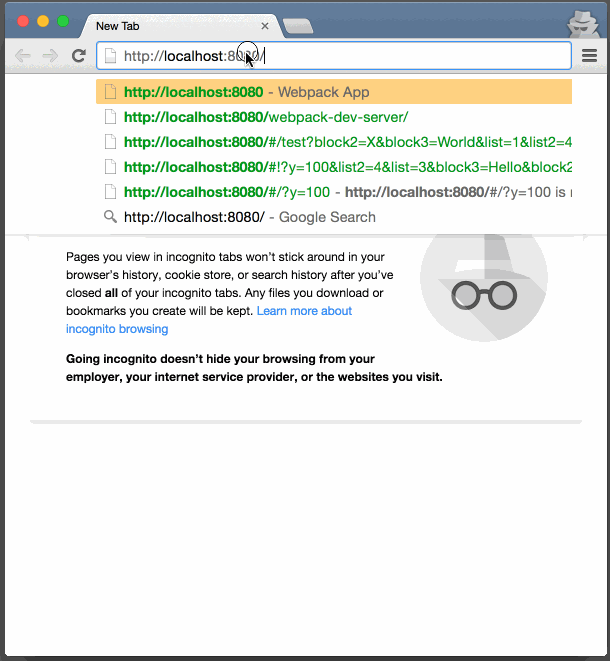

# in-flux

[](https://circleci.com/gh/nkbt/in-flux)
[](https://coveralls.io/r/nkbt/in-flux?branch=master)
[](https://david-dm.org/nkbt/in-flux)
[](https://david-dm.org/nkbt/in-flux#info=devDependencies)

Flux-based partial routing solution

**Not a replacement for `react-router`.** Could be used as addition to it. Or standalone.

**WARNING** Work in progress, though most of the functionality is there.

See [issues](https://github.com/nkbt/in-flux/issues) for more info on what is going to happen.


## Idea

The idea of partial routing is coming from the need to track state of independent components in the URL.

Commonly used routers are mostly hierarchical. The great example of such a router is [react-router](https://github.com/rackt/react-router).
Unfortunately it is not possible to store component's state independently from the other component in a different "branch" of hierarchy.

They work perfectly for most of the UIs. 
But as soon as we are trying to build a complex UI with multiple independent components and each of those has own state you would like to preserve, it becomes a challenging task. InFlux was created to provide a simple way of keeping such state in the URL with query params.


Here is an example of such interface. 

1. Chart block, which can be switched from `bar` to `pie`
2. Filter block, that can be `opened` or `closed`
3. Data panel with two tabs: `sources` and `destinations`

```
+------------------------------------------------------------------------------+
|  App "/app"                                                                  |
|                                                                              |
|  +------------------------------+  +---------------------------------------+ |
|  |  chart                       |  |  filter                               | |
|  |  [->bar] [pie]               |  |  [->opened] [closed]                  | |
|  |                              |  |                                       | |
|  |                              |  |                                       | |
|  |                              |  |                                       | |
|  |                              |  |                                       | |
|  |                              |  |                                       | |
|  +------------------------------+  +---------------------------------------+ |
|                                                                              |
|  +---------------------------------------------------+                       |
|  |  data                                             |                       |
|  |  [->sources] [destinations]                       |                       |
|  |                                                   |                       |
|  +---------------------------------------------------+                       |
|                                                                              |
+------------------------------------------------------------------------------+ 
```

As you can see each of these blocks has its own independent navigation and, for example, Filter can be closed or opened independently from currently displayed Chart type or Data tab selected.
 
1. We can always keep the state of each block, but you will loose that state on page refresh.
2. We can keep their states in some specialized Flux Store and cache in `localStorage` or even user settings in database on the server. But we are losing ability to share this page with someone else (unless we have some special "copy/paste state" functionality)
3. At last we can keep state of each component in the URL as query parameter, which solves both problems.
  Current URL will be: `/app?chart=bar&filter=opened&data=sources`

Key feature is to update all links on the page if any of visible blocks changed its state. If lets all links to stay links, so it is possible to open link in a new tab, for instance. It is fixed by InFlux.


## Minimal Example

  ```js
import React from 'react';
import {InFlux, Url, LocationHtml5} from 'in-flux';


const Baz = React.createClass({
  render() {
    const {value} = this.props.inFlux;
    return <h1>{value && value.toUpperCase()}</h1>;
  }
});

const App = React.createClass({
  render() {
    return (
      <div>
        <LocationHtml5 />
        <Url query={{baz: 'foo'}}>Foo</Url> | <Url query={{baz: 'bar'}}>Bar</Url>
        <InFlux config={Baz} namespace="baz" />
      </div>
    );
  }
});

React.render(<App />, document.body);
  ```

  

  You can run the Minimal example with `npm run foobar`, it is shipped with the source code.


## Quick-start

Quick-start is a step-by-step walk-through to implement UI based on ASCII example from above. 

### 1. Install `in-flux` from npm
  ```bash
npm install --save in-flux
  ```

### 2. Add App and main blocks: Chart, Filter, Data 
  
  ```js
import React from 'react';

const Chart = React.createClass({
  render() {
    return <h2>Chart</h2>;
  }
});


const Filter = React.createClass({
  render() {
    return <h2>Filter</h2>;
  }
});


const Data = React.createClass({
  render() {
    return <h2>Data</h2>;
  }
});


const App = React.createClass({
  render() {
    return (
      <div>
        <Chart />
        <Filter />
        <Data />
      </div>
    );
  }
});

React.render(<App />, document.body);
  ```
  
### 3. Add second-level blocks (not yet used for now)
  ```js
const ChartBar = React.createClass({
  render() {
    return <h3>Bar</h3>;
  }
});

const ChartPie = React.createClass({
  render() {
    return <h3>Pie</h3>;
  }
});

const FilterClosed = React.createClass({
  render() {
    return <h3>Closed</h3>;
  }
});

const FilterOpened = React.createClass({
  render() {
    return <h3>Opened</h3>;
  }
});

const DataSources = React.createClass({
  render() {
    return <h3>Sources</h3>;
  }
});

const DataDestinations = React.createClass({
  render() {
    return <h3>Destinations</h3>;
  }
});
  ```

### 4. Add InFlux

  Wrap each main component, give it a namespace and config
  
  Also render Location provider (LocationHtml5 for History-API links or LocationHtml4 for hash-links).

  ```js
import {InFlux, LocationHtml5} from 'in-flux';
//...

const App = React.createClass({
  render() {
    return (
      <div>
        <InFlux namespace="chart"
          config={{bar: ChartBar, pie: ChartPie}}>
          <Chart />
        </InFlux>
        <InFlux namespace="filter"
          config={{opened: FilterOpened, closed: FilterClosed}}>
          <Filter />
        </InFlux>
        <InFlux namespace="data"
          config={{sources: DataSources, destinations: DataDestinations}}>
          <Data />
        </InFlux>
      </div>
    );
  }
});
  ```

### 5. Update your main components with links

Note that <InFlux> wrapper will provide `inFlux` object to the props of container component.

For now we will use only `namespace` and `Component`. First just passes namespace down, second should be rendered wherever we want to have our route handler component.


We will also use `Url` component provided by `in-flux` to render dynamic links (they will be updated when any of InFlux blocks changes its state.

  ```js
import {Url} from 'in-flux';

onst Chart = React.createClass({
  render() {
    const {namespace, Component} = this.props.inFlux;
    return (
      <div>
        <h2>Chart</h2>
        <Url query={{[namespace]: 'bar'}}>Bar</Url>
        <Url query={{[namespace]: 'pie'}}>Pie</Url>
        <Component />
      </div>
    );
  }
});


const Filter = React.createClass({
  render() {
    const {namespace, Component} = this.props.inFlux;
    return (
      <div>
        <h2>Filter</h2>
        <Url query={{[namespace]: 'opened'}}>Open</Url>
        <Url query={{[namespace]: 'closed'}}>Close</Url>
        <Component />
      </div>
    );
  }
});


const Data = React.createClass({
  render() {
    const {namespace, Component} = this.props.inFlux;
    return (
      <div>
        <h2>Data</h2>
        <Url query={{[namespace]: 'sources'}}>Sources</Url>
        <Url query={{[namespace]: 'destinations'}}>Destinations</Url>
        <Component />
      </div>
    );
  }
});
  ```

### 6. PROFIT

  Compile your code, the routing is now completed.
  
  
  
  
  **NOTE** href changes, so we can open link in new tab.
  
  
  You can run the full Quickstart example with `npm run example`, it is shipped with the source code.
  
## Development and testing

To run comprehensive example covering all `InFlux` features, use `npm start`, which will compile `src/example/Example.js`

```bash
git clone git@github.com:nkbt/in-flux.git
cd in-flux
npm install
npm start

# then
open http://localhost:8080
```

To run Foobar example, use `npm run foobar`

To run Quick-start example, use `npm run quickstart`


## Demo

[http://nkbt.github.io/in-flux/example](http://nkbt.github.io/in-flux/example)

## Tests

1. UI for manual testing - `npm start`, open `http://localhost:8080`
2. Automated tests are in `./test` and should be run with `npm run test:dev` (watch mode)
3. Coverage report is generated by running `npm run test:cov`

## License

MIT
